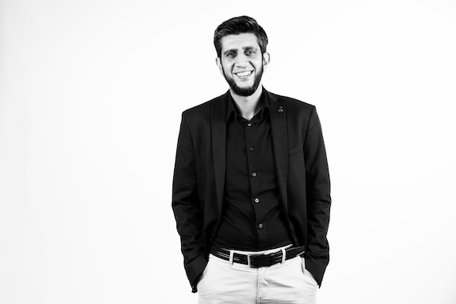

# Ismail Dhorat

`#ismail — leadership, business, software, systems, faith & things worth building`



**Wayfarer · Learning in public.**

```text
* dissi has joined #ismail
* Topic: Building. Asking questions. Taking notes.
```

## /whois dissi

A builder at heart. I build companies, communities and products.

I fell in love with technology after spending what felt like hours typing code into a Commodore 64, just to make a ball bounce around the screen. I’ve been hooked ever since: teaching myself to code, building websites while still in high school, hacking and eventually building software and companies. My first "business" was developing sites for companies while still in school.

I am curious about systems, What happens when we try to change them, and how do we know whether the change is good?

I explore those questions through technology, business, leadership and Islamic thought. I’m interested in how social, technological, psychological and political systems shape our lives; how we create the conditions for people and communities to flourish; and how might we develop the wisdom to act well within those systems.

Currently building with others at **Zyelabs**, **Ummah Tech** and the **TPSS Accelerator**.

## Elsewhere on the interwebs 

- [LinkedIn](https://www.linkedin.com/in/ismaildhorat/)
- [Instagram](https://www.instagram.com/issid/)
- [Twitter](https://www.twitter.com/ismail)
- [GitHub](https://github.com/ismaild)
- [Substack](https://ismaildhorat.substack.com)
- [Hacker News](https://news.ycombinator.com/user?id=ismail)
- [Codiez](https://blog.codiez.co.za)
- [Global Voices](https://globalvoices.org/author/ismail-dhorat/)
- [Good Reads](https://goodreads.com/ismaild)

## /list — Active channels

### [Zyelabs](https://www.zyelabs.net)

**Founder & Managing Director**

We build the data platforms, pipelines, software and dashboards that help organisations make better decisions. Our work spans data engineering, analytics, architecture and design, including getting analytical models into production.

### [Ummah Tech](https://ummahtech.net/)

**Co-Creator**

A South African nonprofit community of Muslim technologists, founders, researchers and creatives. I helped fund and launch it to bring people together around ethical technology, collaboration and work that benefits the wider community.

### [Basira Collective](https://basiracollective.com/)

A community of practice exploring how individuals, teams and communities can navigate complexity with clarity, care and responsibility. Its work develops systems thinking, systems leadership and strategic judgment through practical learning, facilitation and reflection.

### TPSS Accelerator

**Founding Core Team Member**

A six-week enablement programme and funding pathway for Muslim founders building early-stage and early-growth ventures. Built by Muslim leaders, it helps founders move from intention to execution.

The accelerator is open to Muslim founders anywhere in the world, across tech and non-tech, for-profit and nonprofit ventures.

I’m part of the founding core team of six. I helped design the programme and delivered the strategy and go-to-market module.

## #startup-graveyard

Past ventures. Hard knocks. Lessons carried forward.

### ChowHub · 2012–2013

**Co-Founder & CEO**

A venture-backed startup connecting customers with restaurants through an online takeaway and food-delivery marketplace. I worked across the concept, fundraising, customer development, product strategy and launch.

### zapAride · 2015

**Co-Founder**

A ride-sharing service for people commuting to work. I worked across customer research, product strategy and launch, and led the development team.

## #build-log

### Enterprise Data & Analytics

Through Zyelabs, I’ve led teams designing and delivering data solutions that help organisations understand customers and improve decisions. My client experience includes Cell C, du, MultiChoice and FNB.

### Customer Retention in Telecommunications

Led a team building applications to calculate customer lifetime value and recommend suitable packages, supporting a mobile operator’s customer-retention initiatives.

### Ummah Tech Community & Conferences

Bringing people together around faith, technology and social contribution through conferences, conversations and collaboration. I served as event director for the inaugural Ummah Tech Conference in Johannesburg in 2024.

### Character Development & Practical Wisdom

How do we develop the character and judgment to act well?

My Executive MBA research explored the pursuit of character development and practical wisdom from an Islamic perspective, engaging with the work of Al-Ghazali and Aristotle.

## #working-notes

Academic writing, working papers and extracts on systems thinking, leadership, management practice and Islamic thought. Ideas that always up for further refinement, challenges or alteante views. Each link below opens a PDF in Google Drive.

- **[Character Development & Practical Wisdom — Research Abstract](https://drive.google.com/file/d/1LzIlV__Cte3sNQw_-0JXIzCOoY0Vyq7b/view)** — The abstract of my research, *Towards a theory on the pursuit of character development and practical wisdom from an Islamic perspective*.

- **[Character Development & Practical Wisdom — Research Report Extract](https://drive.google.com/file/d/1NrKEvkmzTDc8Ax6xNBgk8onRptazK3Vk/view)** — An extract from the same research report.

- **[Towards a Philosophy of Leadership](https://drive.google.com/file/d/10PbefBOiroRsa089XYogqd_M8lsHBAEg/view)** — A discussion note exploring leadership in practice, complexity, distributed knowledge and generative conversations.

- **[Leadership as Practice](https://drive.google.com/file/d/1QaXyHc4bQJGH4bzHRhDl8DiZolDrpYTS/view?usp=share_link)** — Reflections on leadership as practice that informed the discussion above.

- **[Toward a Theory of Multiplex Management Practice](https://drive.google.com/file/d/1PWj2E-tcRshqRzbr1MpGLpWNI6ilpAVw/view)** — Drawing on Maratib al-Wujud and Tashkubri-Zadah’s classifications, written for Classical Perspectives on Islamic Education. January 2026.

- **[Re-Orientating Management Practice Through the Lens of Al-Attas](https://drive.google.com/file/d/1OzVLTfBh9wvCxwWb1Ub5SiFwlO9_OtU3/view)** — An essay on management practice through the thought of Al-Attas, written for Classical Perspectives on Islamic Education. January 2026.

- **[Cybernetics & the Viable System Model — Extract](https://drive.google.com/file/d/1Le66o-9a3JKMBQBEOd0Hy5YDdxE417VE/view)** — A conceptual framework introducing management cybernetics, Stafford Beer’s Viable System Model and organisational viability.

- **[Islamic History & Civilisation](https://drive.google.com/file/d/1-IAHWkn3bu4SmKuxKaY2EDNrFs5q0k6Q/view)** — Essays examining Islam as an open civilisation and the narrative of decline in the post-classical age. December 2024.

[Browse the full working papers folder](https://drive.google.com/drive/folders/1En_rjgnWXtd9PdljoCBmTf-HLkC21n-6)

## #formal-learning

### Diploma in Multiplex Islamic Education

**Usul Academy · 2025–2026**

### Diploma in Islamic Foundations

**Usul Academy · 2024–2025**

### Executive MBA

**University of Cape Town Graduate School of Business · 2019–2020**

Research (2024): *Towards a theory on the pursuit of character development and practical wisdom from an Islamic perspective.*

### Postgraduate Diploma in Management Practice

**University of Cape Town Graduate School of Business · 2017–2018**

### Additional Learning

- **Saïd Business School, University of Oxford** — Global Network for Advanced Management programme in Real Estate, June 2024.
- **UBC Sauder School of Business** — Global Network for Advanced Management programme on COVID-19, Sustainability and the Future of Business.

## #talks-and-conversations

- **[Ashraf Garda & Ismail Dhorat — Ummah Tech Conference 2024](https://www.youtube.com/watch?v=CtxoiQWmdFw)** — A conversation about Muslim participation and leadership in technology.
- **[The Madinah Operating System — Ummah Tech Conference 2025](https://www.youtube.com/watch?v=RIIAUvbmI-o)** — My talk at Ummah Tech Conference 2025.
- **[Conquering the Cliff — Between Classes by QIA](https://www.youtube.com/watch?v=kxppYKyDQCU)** — A conversation with Muhammad Bagus about climbing, challenges and experiences in the mountains. August 2024.

## #recognition

- Future 100 Entrepreneurs — Platinum Award
- U-Start Bluum — Finalist
- Angel Fair — Finalist
- Maxum Business Plan — Winner

## /away — Beyond the keyboard

Hiking, mountains, fitness and good coffee.

I’m interested in lifelong learning, faith, character and practical ways we can contribute to the people and communities around us.

```text
* dissi is away: with my kids, at the gym, on a side quest, in the mountains, or making coffee.
```


```text
* dissy has joined #islam
* Topic: Why am I here? Who am I? How should I be?
         Who should I serve? What is the meaning of life? 
* Connection reset by peer
```
